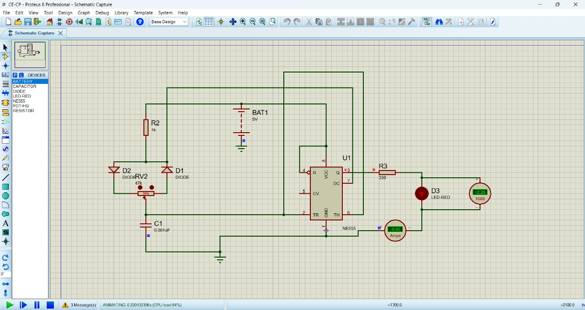
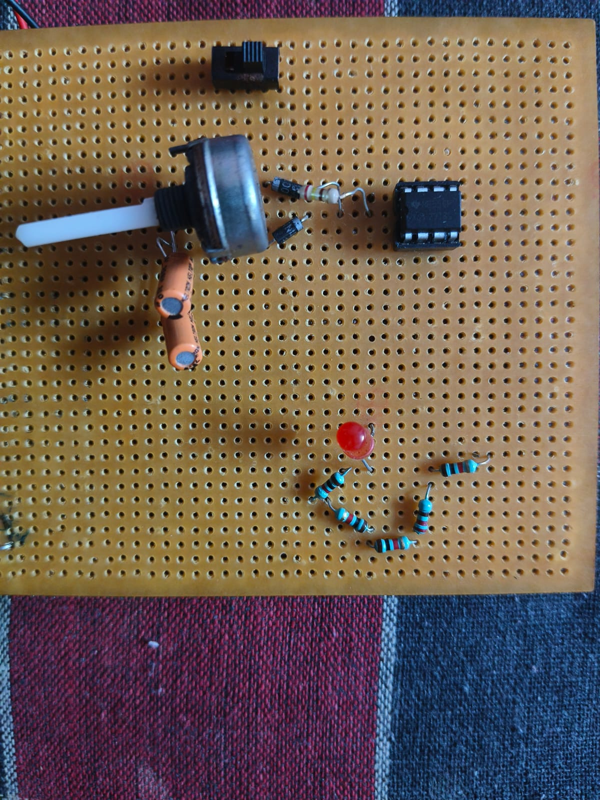

# 555 Timer-Based PWM LED Dimmer / Controller

This repository contains the documentation, hardware setup, and implementation details for a **Pulse Width Modulation (PWM) LED Dimmer Circuit** powered by the **NE555 Timer IC**. 

By controlling the duty cycle of the PWM signal rather than dropping the supply voltage linearly, this circuit delivers highly efficient brightness control from 0% to 100% without causing energy loss through heat dissipation or LED color shifting.

---

## 🚀 Features

* **Smooth 0–100% Dimming:** Fluid control over LED brightness using a precision potentiometer interface.
* **Flicker-Free Performance:** Operates at a switching frequency high enough to be completely imperceptible to the human eye.
* **High Efficiency:** Minimizes power dissipation across the driving transistor, making it ideal for battery-powered applications or high-power LED strips.
* **Scalable Power Stage:** The dedicated switching transistor handles low-power indicator LEDs as well as larger high-brightness LED modules or 12V LED strips.

---

## 💡 How It Works

The circuit configures an **NE555 Timer** as an astable multivibrator to generate a continuous square wave:

1. **Duty Cycle Tuning:** Two steering diodes split the path for charging and discharging the main timing capacitor. Turning the potentiometer changes the balance between the charging time ($T_{on}$) and discharging time ($T_{off}$).
2. **Constant Frequency:** Because the total resistance path remains the same across the potentiometer's track, the overall period stays virtually constant, preserving a stable PWM frequency while only adjusting the duty cycle.
3. **LED Driver Output:** The pulsed output from Pin 3 drives the gate/base of an N-channel power element (such as a transistor or MOSFET), rapidly switching the negative terminal of the LED path to ground to control the average forward current.

---

## 📦 Bill of Materials (BOM)

| Component Designator | Component Type / Suggested Value | Quantity | Description |
| :--- | :--- | :--- | :--- |
| **IC1** | NE555 Timer IC | 1 | PWM Controller (8-Pin DIP package) |
| **Q1** | Power Transistor / MOSFET | 1 | Low-side power switch driving the load |
| **VR1** | Potentiometer (10kΩ / 50kΩ) | 1 | Manual brightness adjustment knob |
| **D1, D2** | 1N4148 | 2 | Signal diodes for charging/discharging path division |
| **R1, R2** | Biasing & Current Limiting Resistors | 2 | Protection resistors for timing lines and driving gate |
| **C1, C2** | Ceramic Capacitors | 2 | Timing capacitor and control voltage decoupling |
| **J1** | 2-Pin Screw Terminal | 1 | DC Power Supply Input (5V - 12V dependent on LED specification) |
| **J2** | 2-Pin Screw Terminal | 1 | LED / LED Strip Output connections |

---

## 📸 Hardware Implementation & Setup

The physical prototype is constructed using a robust single-layer PCB base that organizes the timing control, input/output terminal points, and adjustments.

### 1. Overall System Configuration
The following image highlights the physical layout of the circuit, featuring the potentiometer placement, centralized NE555 processing block, and output hookups:



### 2. Operational Testing
This close-up details the assembly connections and layout flow managing current delivery to the LED load:



---

## 📁 Repository Structure

```text
├── assets/
│   ├── led_pwm_setup_1.jpeg     # Circuit layout and component assembly overview
│   └── led_pwm_setup_2.jpeg     # Close-up view of hardware testing
└── README.md                    # Core project documentation