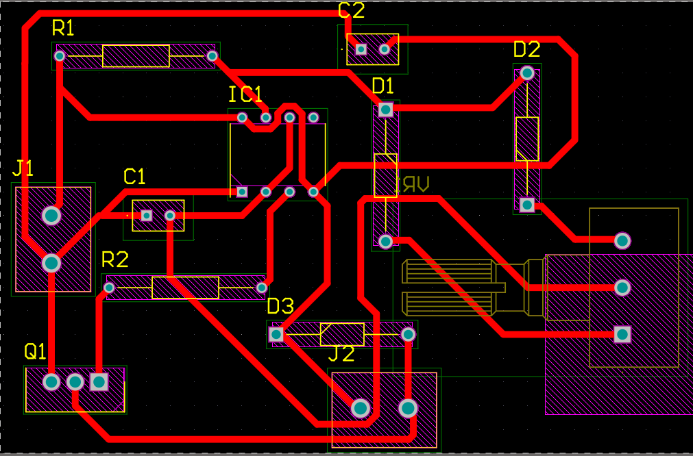
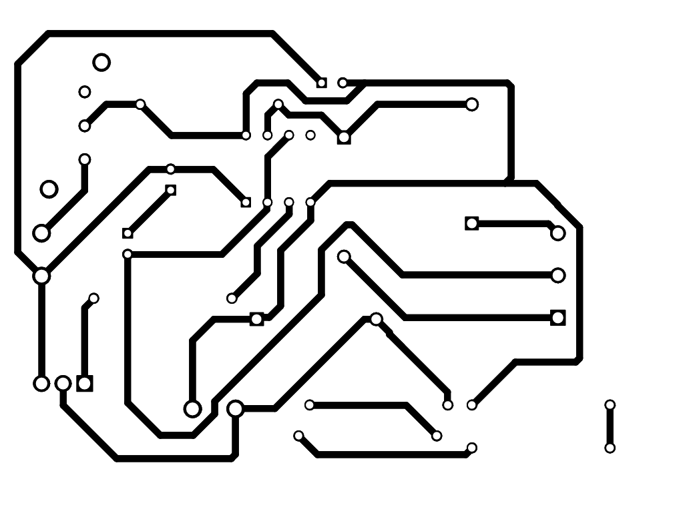
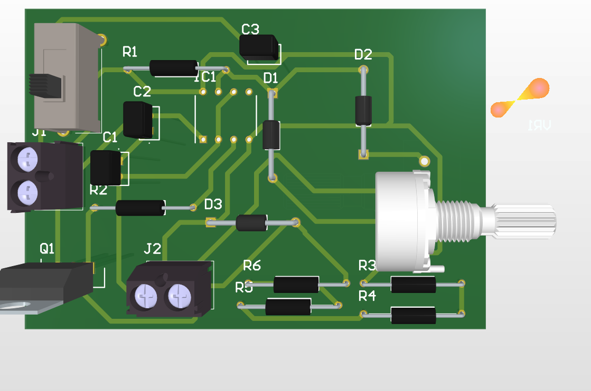
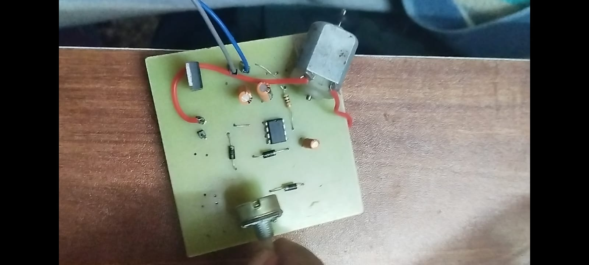

# 555 Timer-Based PWM DC Motor Speed Controller

This repository contains the complete design, PCB layout, and physical hardware implementation of a **Pulse Width Modulation (PWM) DC Motor Speed Controller** built using the classic **NE555 Timer IC**. 

Unlike simple voltage-drop regulation methods that waste energy as heat, this design utilizes high-efficiency PWM to control motor speed smoothly from 0% to 100% while maintaining high torque even at low speeds.

---

## 🚀 Features

* **High-Efficiency PWM Control:** Uses variable duty cycle switching to minimize power loss across the driving transistor.
* **Wide Duty Cycle Range:** Independent diode-steering network allows customization of the duty cycle from ~0% to ~100% without significantly shifting the switching frequency.
* **Inductive Protection:** Integrated flyback diode safeguarding the driver circuit from high-voltage back-EMF spikes.
* **Compact PCB Footprint:** Optimized single-layer design perfect for DIY etching or low-cost rapid prototyping.

---

## 🛠️ System Overview & Working Principle

The heart of the circuit is the **NE555 Timer** configured as an astable multivibrator. 

1. **PWM Generation:** Capacitor `C1` charges and discharges through the potentiometer `VR1`. 
2. **Diode Steering Network:** Two steering diodes (`D1` and `D2`) split the charging and discharging paths. Turning the potentiometer adjusts the ratio of the charge time ($T_{on}$) to the discharge time ($T_{off}$), altering the duty cycle while keeping the total period ($T_{on} + T_{off}$) relatively constant.
3. **Power Driver Stage:** Since the NE555 output pin cannot source enough current to run a DC motor directly, the PWM signal drives the gate/base of power component `Q1` (typically an N-Channel Power MOSFET like the IRFZ44N or a robust Power BJT), which switches the motor's ground path.

---

## 📦 Bill of Materials (BOM)

| Component Designator | Component Type / Suggested Value | Quantity | Description |
| :--- | :--- | :--- | :--- |
| **IC1** | NE555 Timer IC | 1 | PWM Signal Generator (8-Pin DIP) |
| **Q1** | IRFZ44N (or equivalent N-Ch MOSFET) | 1 | Power switching element |
| **VR1** | 10kΩ / 50kΩ Potentiometer | 1 | Speed adjustment control knob |
| **D1, D2** | 1N4148 | 2 | Fast-switching steering diodes |
| **D3** | 1N4007 | 1 | Flyback protection diode |
| **R1** | 1kΩ Resistor | 1 | Charges protection line / Current limiter |
| **R2** | 10Ω - 1kΩ Resistor | 1 | Gate/Base protection resistor |
| **C1** | 10nF - 100nF Ceramic Capacitor | 1 | Timing capacitor (sets PWM frequency) |
| **C2** | 10nF Ceramic Capacitor | 1 | Pin 5 Control Voltage decoupling |
| **J1** | 2-Pin Screw Terminal Block | 1 | DC Power Input Supply |
| **J2** | 2-Pin Screw Terminal Block | 1 | DC Motor Output Hookup |

---

## 📐 Hardware Design & PCB Layout

The PCB was designed using automated EDA layout tools with thick traces on the power lines to handle the motor's stall current safely.

### 1. PCB Layout Routing (Top View)
The layout separates the low-power timing control circuitry from the high-current motor driving path.


### 2. Bottom Copper Layer Mask
Ready-to-print negative trace mask for single-sided toner transfer fabrications.


### 3. 3D Visualization
A preview render showing expected spatial clearances and component alignments prior to assembly.


---

## 🛠️ Hardware Fabrication & Assembly

The circuit has been successfully fabricated, populated, and field-tested using a standard 12V DC hobby motor.

### Physical Implementation
Below is the assembled single-layer PCB prototype featuring the control unit, driver stage, and integrated potentiometer knob:



> ⚠️ **Note on Assembly:** Ensure that the flyback diode `D3` is oriented correctly (cathode to the positive power rail). Reversing this diode will create a direct short-circuit across your power supply when `Q1` turns on.

---

## 📁 Repository Structure

```text
├── assets/
│   ├── pcb_layout_routing.png
│   ├── copper_bottom_mask.png
│   ├── pcb_3d_render.png
│   └── physical_hardware_prototype.jpeg
└── README.md               # Documentation
